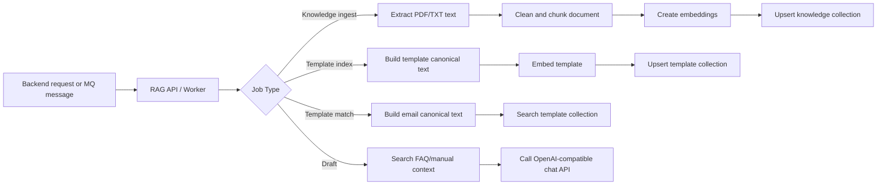

<div align="center">

# Maily RAG Server

EmailAssist RAG

FAQ, 업로드 문서, 템플릿 메타데이터를 검색 가능한 지식으로 바꾸고 메일 답변 후보 생성에 필요한 문맥을 제공하는 FastAPI 기반 RAG 서버입니다.


[Overview](#overview) · [Features](#features) · [Quick Start](#quick-start) · [API](#api) · [RabbitMQ](#rabbitmq) · [Tech Stack](#tech-stack)

</div>

## Overview

`RAG`는 Maily 백엔드와 AI 파이프라인 사이에서 검색용 지식과 템플릿 후보를 관리합니다.

현재 구현은 HTTP API 서버와 RabbitMQ worker를 모두 제공합니다. HTTP API는 로컬 테스트와 직접 연동에 적합하고, MQ worker는 오래 걸리는 문서 ingest, 템플릿 인덱싱, 템플릿 매칭, 온보딩 템플릿 생성 작업을 비동기로 처리하기 위한 경로입니다.

| Responsibility | Description |
| --- | --- |
| Knowledge ingest | FAQ와 PDF manual을 받아 텍스트 추출, chunking, embedding, Chroma upsert를 수행합니다. |
| Text extraction | TXT/PDF payload, local path, presigned URL 입력을 처리합니다. |
| PDF cleanup | 반복 header/footer, 하단 페이지 번호, 비지식성 표지/결재 페이지를 보수적으로 제거합니다. |
| OCR fallback | 이미지형 PDF는 Tesseract OCR을 시도합니다. |
| Template index | 템플릿 제목, intent, tone, domain, metadata를 canonical text로 만들고 벡터화합니다. |
| Template match | 메일 canonical text와 가장 가까운 템플릿 후보를 검색합니다. |
| Draft context | 온보딩 템플릿 생성 시 사용자별 FAQ/manual chunk를 찾아 참고 문맥으로 보강합니다. |
| Vector storage | 사용자별 `knowledge:{user_id}`, `template:{user_id}` namespace를 Chroma collection으로 분리합니다. |

## Features

| Feature | Description |
| --- | --- |
| OpenAI 호환 API | `/v1/chat/completions`, `/v1/embeddings` 형식의 외부 LLM/embedding 서버를 사용합니다. |
| 임베딩 backend 선택 | `embedding_api`와 개발용 `hash` fallback을 지원합니다. |
| Chroma backend 선택 | 로컬 persistent Chroma와 외부 ChromaDB HTTP server를 환경변수로 전환합니다. |
| LangChain semantic chunking | PDF는 semantic chunking을 우선 시도하고 실패하면 native chunking으로 fallback합니다. |
| Pydantic alias 호환 | `mail_tone/email_tone`, `intent/category_name`, `body/body_clean`처럼 인접 서비스 naming 차이를 흡수합니다. |
| 단계적 template fallback | `intent + tone + domain`, `intent`, 필터 없음 순서로 검색 범위를 완화합니다. |
| RabbitMQ progress | 작업 시작, 진행, 성공, 실패 이벤트를 `2app.rag.progress`로 발행합니다. |
| Retry 판단 | 외부 API 429/5xx, 연결 오류, 일시적 파일 미존재 등 재시도 가능한 오류를 구분합니다. |
| 컨테이너 실행 | Dockerfile은 Python 3.12 slim, Tesseract, healthcheck, combined server/worker start script를 포함합니다. |

## Quick Start

```bash
python -m venv .venv
source .venv/bin/activate
pip install -e ".[dev]"
cp .env.example .env
uvicorn app.main:app --reload --host 0.0.0.0 --port 8090
```

상태 확인:

```bash
curl http://127.0.0.1:8090/health
```

기본 응답:

```json
{
  "status": "ok",
  "embedding_backend": "embedding_api",
  "vector_backend": "chroma"
}
```

외부 임베딩 API 없이 흐름만 확인하려면 `.env`에서 아래 값을 사용합니다.

```text
EMBEDDING_BACKEND=hash
EMBEDDING_DIMENSIONS=384
```

## API

| Method | Path | Role |
| --- | --- | --- |
| `GET` | `/health` | 서버 상태, embedding backend, vector backend 확인 |
| `POST` | `/knowledge/ingest` | FAQ/manual을 한 번에 적재 |
| `POST` | `/knowledge/index` | 이미 추출된 문서 텍스트를 chunk/index |
| `POST` | `/knowledge/search` | 사용자별 knowledge chunk 검색 |
| `POST` | `/templates/index` | 템플릿 검색 인덱스 저장 |
| `POST` | `/templates/match` | 메일과 가까운 템플릿 후보 검색 |
| `POST` | `/extract-text` | base64 파일 payload에서 텍스트 추출 |
| `POST` | `/canonical/email` | 메일 검색용 canonical text 생성 |
| `POST` | `/canonical/template` | 템플릿 검색용 canonical text 생성 |

호환을 위해 `/v1/...` 경로도 함께 유지합니다.

최종 백엔드 연동의 우선 API는 아래 네 개입니다.

```text
GET  /health
POST /knowledge/ingest
POST /templates/index
POST /templates/match
```

## RabbitMQ

worker 실행:

```bash
python -m app.worker
```

| Queue | Routing Key | Role |
| --- | --- | --- |
| `q.2rag.knowledge.ingest` | `2rag.knowledge.ingest` | FAQ/manual ingest 요청 |
| `q.2rag.templates.index` | `2rag.templates.index` | 템플릿 index 요청 |
| `q.2rag.templates.match` | `2rag.templates.match` | 템플릿 match 요청 |
| `q.2rag.draft` | `2rag.draft` | 온보딩 템플릿 생성 요청 |
| `q.dlx.failed` | queue direct publish | 최종 실패 메시지 보관 |

응답과 진행 이벤트는 `x.rag2app.direct` exchange로 발행합니다.

| Routing Key | Role |
| --- | --- |
| `2app.knowledge.ingest` | knowledge ingest 결과 |
| `2app.templates.index` | template index 결과 |
| `2app.templates.match` | template match 결과 |
| `2app.rag.draft` | onboarding draft 결과 |
| `2app.rag.progress` | 진행 상태 이벤트 |

## How It Works



## Vector Storage

RAG는 별도 비즈니스 DB를 두지 않고 Chroma에 검색용 파생 데이터만 저장합니다. 원본 데이터의 source of truth는 Backend DB입니다.

| Namespace | Chroma Collection | Content |
| --- | --- | --- |
| `knowledge:1` | `knowledge_1` | user 1의 FAQ/manual chunk |
| `template:1` | `template_1` | user 1의 template canonical text |
| `knowledge:2` | `knowledge_2` | user 2의 FAQ/manual chunk |
| `template:2` | `template_2` | user 2의 template canonical text |

local persistent mode:

```text
VECTOR_BACKEND=chroma
CHROMA_PERSIST_DIRECTORY=.rag-data/chroma
```

external ChromaDB server mode:

```text
VECTOR_BACKEND=chroma_http
CHROMA_HOST=localhost
CHROMA_PORT=8000
CHROMA_SSL=false
```

collection 확인:

```bash
python scripts/check_chroma.py
```

## Folder Structure

```text
RAG/
├─ app/
│  ├─ main.py                      # FastAPI HTTP API
│  ├─ worker.py                    # RabbitMQ consumer / publisher
│  ├─ config.py                    # 환경변수 기반 설정
│  ├─ schemas.py                   # HTTP API schema
│  ├─ mq/
│  │  └─ schemas.py                # MQ message schema
│  └─ services/
│     ├─ canonicalization.py       # email/template canonical text
│     ├─ chunking.py               # native chunking
│     ├─ document_chunking.py      # document split orchestration
│     ├─ document_parser.py        # TXT/PDF/local/presigned URL/OCR extraction
│     ├─ draft_service.py          # onboarding template generation
│     ├─ embedding.py              # embedding_api/hash backend
│     ├─ index_store.py            # Chroma vector store
│     ├─ openai_compatible_client.py
│     └─ runtime.py                # shared service instances
├─ docs/
├─ docker/
├─ scripts/
├─ tests/
├─ .env.example
├─ Dockerfile
├─ pyproject.toml
└─ README.md
```

## Environment

| Variable | Default | Description |
| --- | --- | --- |
| `RAG_HOST` | `0.0.0.0` | API bind host |
| `RAG_PORT` | `8090` | API port |
| `MOCK_MODE` | `false` | LLM 호출 없이 mock 생성 사용 여부 |
| `LLM_API_BASE_URL` | `http://cellm.gachon.ac.kr:8000/v1` | OpenAI 호환 chat API base URL |
| `LLM_API_KEY` | empty | chat API key |
| `LLM_CHAT_MODEL` | `text` | chat model alias |
| `EMBEDDING_API_BASE_URL` | empty | 비어 있으면 LLM API base URL 재사용 |
| `EMBEDDING_API_KEY` | empty | 비어 있으면 LLM API key 재사용 |
| `EMBEDDING_MODEL` | `text-embedding-3-small` | embedding model alias |
| `EMBEDDING_BACKEND` | `embedding_api` | `embedding_api` 또는 `hash` |
| `VECTOR_BACKEND` | `chroma` | `chroma` 또는 `chroma_http` |
| `CHUNKING_BACKEND` | `langchain` | `langchain` 또는 native fallback |
| `PDF_CHUNKING_STRATEGY` | `semantic` | PDF chunking strategy |
| `PDF_OCR_ENABLED` | `true` | 이미지형 PDF OCR fallback |
| `PDF_OCR_LANGUAGES` | `kor` | Tesseract OCR language |
| `MAX_UPLOAD_BYTES` | `10485760` | payload/download size limit |
| `RABBITMQ_*` | see `.env.example` | worker connection, queue, routing 설정 |

## Docker

```bash
docker build -t maily-rag .
docker run --rm -p 8090:8090 --env-file .env maily-rag
```

이미지는 `tesseract-ocr`와 `tesseract-ocr-kor`를 포함하고, `/health` 기반 healthcheck를 제공합니다.

## Tech Stack

| Layer | Technology | Role |
| --- | --- | --- |
| API | FastAPI, Uvicorn | HTTP endpoint |
| Schema | Pydantic v2, pydantic-settings | request/response/env validation |
| Vector DB | ChromaDB | persistent / HTTP vector storage |
| Embedding | OpenAI-compatible embeddings, hash fallback | semantic search vector |
| Chunking | LangChain text splitters, native paragraph chunker | document split |
| PDF | PyMuPDF, Tesseract OCR | PDF text extraction and OCR fallback |
| MQ | RabbitMQ, pika | asynchronous job consume/publish |
| Test | pytest, httpx | unit/API tests |

## Tests

```bash
pytest
```

현재 테스트는 canonicalization, chunking, document parser/chunking, draft service, index store, HTTP endpoint, OpenAI 호환 client/service 경로를 다룹니다.

## Docs

| Document | Role |
| --- | --- |
| [docs/README.md](docs/README.md) | RAG 문서 인덱스 |
| [docs/연동-개요.md](docs/연동-개요.md) | Backend/AI/Infra 연결 개요 |
| [docs/API-명세.md](docs/API-명세.md) | HTTP API 계약 |
| [docs/RabbitMQ-명세.md](docs/RabbitMQ-명세.md) | MQ topology와 메시지 계약 |
| [docs/Chroma-저장구조-ERD.md](docs/Chroma-저장구조-ERD.md) | Chroma 저장 구조 |
| [docs/로컬-UI-연동-및-배포-체크리스트.md](docs/로컬-UI-연동-및-배포-체크리스트.md) | 로컬 UI/E2E 확인 경로 |

## Caution

- `hash` embedding은 개발용 fallback이며 운영 semantic 품질을 대체하지 않습니다.
- 이미지형 PDF 처리는 서버에 Tesseract와 언어 데이터가 설치되어 있어야 합니다.
- `templates/match`는 후보 검색을 수행하며, 사용 이력이나 비즈니스 규칙 기반 최종 rerank는 Backend 책임입니다.
- RAG 저장소는 검색용 파생 데이터만 보관합니다. 원본 FAQ, manual, template의 source of truth는 Backend DB입니다.
- RabbitMQ topology는 운영 환경에서 retry queue, DLQ, TTL 정책과 함께 인프라 레벨에서 고정하는 것을 권장합니다.
